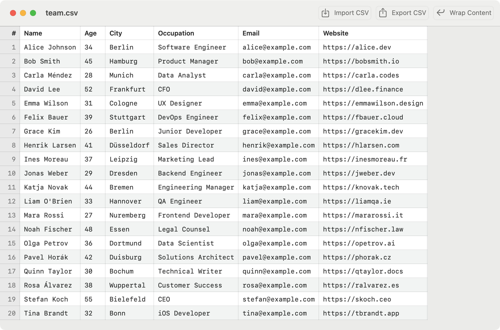

# AirCSV

**A fast, native CSV editor for macOS.**

Open CSV files straight from Finder, edit them like a spreadsheet,
and save them back as exactly what they are: plain text.
No import wizards, no type guessing, no mangled data.




## Why AirCSV?

- **Native and lightweight** —
    A real Mac app built with SwiftUI.
    Starts instantly, feels at home on macOS.
- **Your data stays plain text** —
    What you see is what's in the file.
    Values are never reinterpreted, reformatted, or silently converted.
    Exports use proper CSV quoting and end with a trailing newline.
- **Document-based** —
    Double-click any `.csv` file in Finder and start editing.


## Features

### Edit like a spreadsheet

- Click to select a cell, double-click to edit it
- Navigate with the arrow keys, start editing with `Return`
- `Tab` / `Shift+Tab` move the edit session left and right,
  `Return` moves down
- `Shift+Return` inserts a line break inside a cell
- `Shift+Click` selects a rectangular cell range
- Click a row number or column header to select the whole row or column

### A clipboard that understands tables

- `Cmd+C` / `Cmd+X` / `Cmd+V` work on cells, ranges, rows, and columns
- Pasting expands the table automatically when the data doesn't fit
- Pasted text can be comma-, tab-, or semicolon-separated —
  so data from Excel, Numbers, and other tools just works

### Reorganize with drag & drop

- Drag rows by their row number, columns by their header
- An insertion line shows exactly where the dragged row or column will land

### Undo everything

- `Cmd+Z` / `Shift+Cmd+Z` undo and redo every change —
  cell edits, pastes, deletions, and reorderings

### Columns under control

- Drag a column edge to resize it,
  double-click the edge to fit the content
- Wrap or clip long cell content with one toolbar click

### And more

- Right-click context menus to copy, clear, or delete rows and columns
- Open URLs in cells directly from the context menu
- Row numbers, pinned header row, and a monospaced font
  that keeps data aligned


## Installation

Build and install the app with [Xcode](https://developer.apple.com/xcode/)
installed:

```sh
git clone https://github.com/Airsequel/AirCSV
cd AirCSV
make install
```

This builds a universal binary and copies `AirCSV.app` to `/Applications`.


## Development

```sh
make help    # List all make targets
make dev     # Build and launch the app with an example CSV
make test    # Run the test suite
```
